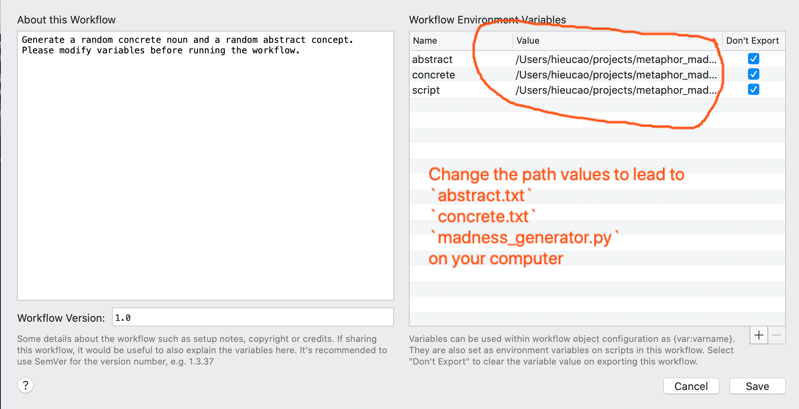

# metaphor_madness

Clone/download the package.
Open `madness_generator.py` and modify paths to `abstract.txt` and `concrete.txt`.
On terminal, change working directory to the reposity and run:

```
python3 madness_generator.py -h
```

Similarly, for the Alfred Workflow, change the variables of the workflow to the paths leading to `abstract.txt`,`concrete.txt`, and `madness_generator.py`.


